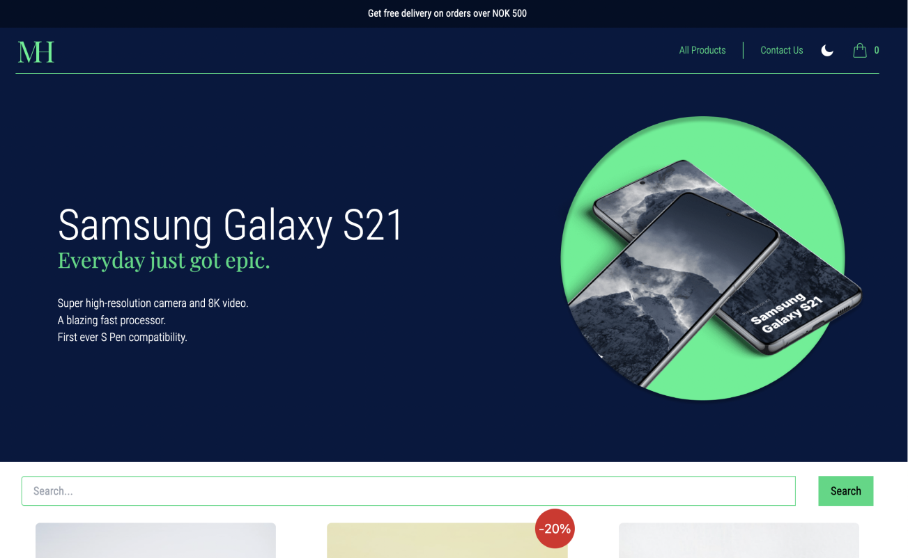

# Markethouse# MarketHouse 🛒

MarketHouse is a modern e-commerce website that offers a wide range of tech products for sale. The main objective of this project is to provide users with a user-friendly platform where they can easily browse and purchase tech items. Users can explore various products, add them to their cart, and proceed with the purchase. The project aims to create a seamless shopping experience for users.

## Features ✨

MarketHouse offers the following features to enhance the shopping experience:

- 📦 Extensive Product Catalog: Users can explore a diverse range of tech products available for purchase.

- 🔍 Search Functionality: Users can search for specific items using keywords or product categories.

- 🛒 Cart Management: Users can add items to their cart, view the contents, and adjust quantities before proceeding to checkout.

- 💳 Secure Checkout Process: Users can securely complete their purchase by providing shipping details and payment information.

- 🚚 Order Tracking: Users can track the status of their orders and receive updates on shipping and delivery.

## Tech Stack ⚙️

This project was developed using the following technologies:

- 📚 React for building the user interface.
- ⚡ Vite as the build tool.
- 🎨 Tailwind for styling.
- 💻 React for interactivity.
- 🖼️ Figma for designing the user interface.
- 📈 GitHub Projects for planning and managing tasks.
- ☁️ Netlify for hosting.

## Live Demo 🔗

You can visit the live demo of the project [here](https://markethouse-demo.netlify.app/).

## Getting Started 🚀

To run the MarketHouse project locally, follow these steps:

1. 🍴 Fork the repository.
2. 📂 Clone the forked repository to your local machine.
3. 📝 Open the project in your favorite code editor.
4. 🛠️ Run `npm install` in the project root directory to install the necessary dependencies.
5. 🏃‍♀️ Run `npm run dev` to start the development server.
6. The project should now be running on `localhost:3000` (or whichever port your environment is set up to use).

## Connect with Me 🤝

LinkedIn: [Your LinkedIn Profile](https://www.linkedin.com/in/your-profile)

Happy shopping at MarketHouse! 💻🛒
